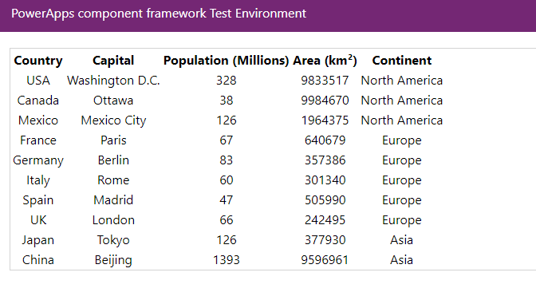
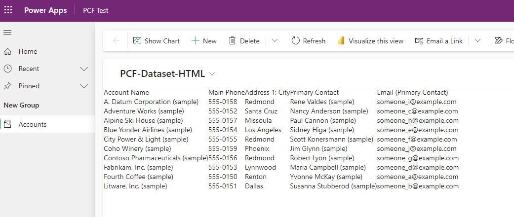

# PCF HTML Dataset Control

## Overview
This Power Apps Component Framework (PCF) control is designed to display data in a tabular format. It dynamically generates a HTML table based on the dataset provided, ideal for rendering structured data like lists or catalogs.

## Sample output
### In test harness

### In a model driven app

## Features
- Dynamically creates a table based on the provided dataset.
- Supports rendering of multiple columns and rows.
- Designed for readability and ease of use.

## Prerequisites
- Power Apps environment.
- Familiarity with PCF and TypeScript.

## Installation
1. Clone or download the repository.
2. Navigate to the control's directory.
3. Run `npm install` to install dependencies.
4. Build the control by running `npm run build`.
5. A Sample CSV is included for you to test this PCF. 
6. Authenticate agaisnt dataverse using the terminal and pac.
7. Push the PCF to dataverse with `pac pcf push --publisher-prefix itweedie`

## Usage
After building the control, it can be imported into your Power Apps environment. It can be used in any model-driven or canvas app where you need to display a dataset in a tabular format.

### Configuration
- **Data Input**: Bind the control to a dataset in your Power Apps environment.
- **Customization**: Modify the TypeScript file for custom behaviors or styles.

## Development
This control is developed using TypeScript. You can extend or modify the control by updating the `pcfHtmlDataset.ts` file.

### Debugging
Use console logs for debugging purposes. Ensure to remove them in the production build for optimal performance.

## License
This project is licensed under the MIT License - see the LICENSE file for details.

## Support
For support and queries, please open an issue in the GitHub repository.
